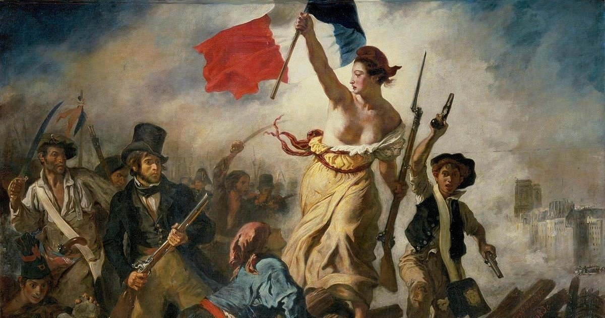

# Delacroix
Ele foi um artista marcado pela revolução francesa.\
Nasceu na França em 26 de abril de 1798.\
Seus pais tinham boa posiçoes sendo a mãe de uma linhagem de desenhistas de móveis.\
E seu pai membro do governo revolucionario.
# Principais caracteristicas do seu estilo.
* Simbolismo sentimentalismo e refinamento
* Inovou algumas cores
* Abordou temas exóticos e religiosos
* Pinceladas são soltas e expressivas 
* Há sensaçoẽs de caos e movimento
* Tecnica de óleo sobre a tela
# A liberdade guiando o povo
#### contexto
1789-1799 cronologia da revolução francesa\
1799 - Acensão de napoleão Bornaparte primeiro como conso e depois governador.\
1814/1815 - Congresso de viena restaura os bubon com Luis 18 e depois com Carlos 10\
1830-Carlos acaba sendo derrubado nessa data\
NIsso o Delacroix foi inspirado nessa data para pintar 'a liberdade guiando o povo'.\
Ele refere-se a revolução de 1830 e não a revolução frnacesa mas querendo ou não se faz referencia a ela. 
#### Analise
* Composição em piramide onde a bandeira é o topo dela.
* A mulher representa a liberdade.
* Ele pode fazer referencia a outro quadro que é 'os fuzilamentos de 3 de maio' de Goya __pintor favorito de Delacroix__.
* Observa três movimentos. 
  * O da morte para vida __Em baixo há varias pessoas mortas na parte de cima pessoas vivas lutando__
  * De sombra para a luz __A liberdade é a luz a razão o ser mais iluminado no quadro__
  * Do passado ao futuro __Do lado da liberdade há uma criança e tambem uma criança com o boné da guarda nacional essas crianças representam o futuro__
* Mariana é o nome da mulher que é representada a liberdade __Os seios para fora é o simbolo que não esta mais submissa um simbolo de insubmissao__