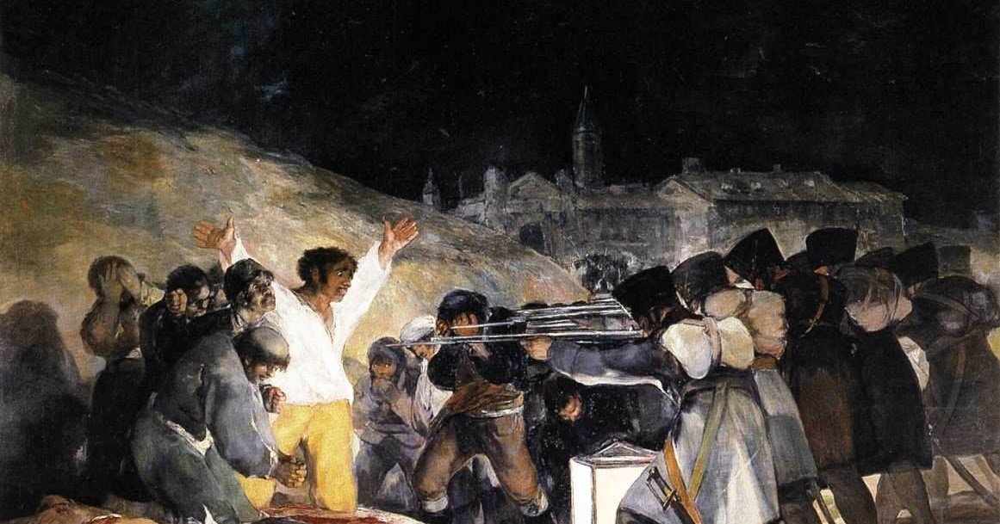

# Goya
Ele pintava horrores da guerra e das assombraçoes do mundo
### Características
1. Começou a carreira aos 13 anos como aprendiz de José luzan
2. Aos 18 foi morar em Madri e foi rejeitado 2 vezes na acaademia de belas artes
3. Em 1771 destacou-se num concurso da cademia de belas artes.
### Estilo
* Retratou vários temas em suas pinturas - Paisagens, Cenas mitológicas, Religião, Imaginário, Guerras, Homens, Mulheres, Deuses, Domônios e Feniceiros.
* Comedia e satira, Tragedia e farsa era tema de suas obras.
* Suas obras de maior destaque foram pinturas a óleo
* Cores vivas e fortes.
# 3 de maio 1808

#### Contexto
No dia 2 de maio o exercitos de Napoleão invadiram Madri e em represalia eles cercaram centenas de espanhois e atiraram contra eles e nisso que o goya se inspira.
#### analise
* O espanhol(trabalhador) que esta de joelho preste a ser fuzilado de braços abertos nos relembra a crucificação de Cristo.
* Sua mão direita esta marcada com um estigma(cicatriz) como as marcas de Cristo.
* Lanterna no chão a unica fonte de luz que permite q os soldados veja seus alvos.
* As pilhas de corpo representam os que lutaram.
* Tem uma figura ajoelhada que foi cercado com outros espanhois mas é imporvavel que ele tenha participado da rebelião.
* Os soldados são anonimos e desumano.