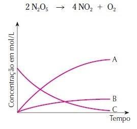

# Cinetica
Estudo da velocidade das reaçoes quimicas e dos fatores que a influenciam.
# Fatores que alteram a velocidade das reações químicas
1. Concentração de reagentes\
    quanto maior a concentração dos reagentes a velocidade tambem é aumentada.\
    quanto mais reagentes mais rapido vai acontecer
2. Superfície de contato\
   Quando dividida ou triturada sua superficie de contato é maior diferente de um bloco inteiro.A superficie de contato se baseia que coisas divididas são mais rapidas de sofrerem reações.
3. Temperatura\
   A maioria das reaçoes quimicas ocorrem mais rapido quando estao em uma temperatura maior a elevação da temperatura acelera o movimento das particulas
4. Presença de catalisador\
   eles aumentam a velocidade de uma reação fornecendo um caminho a para a reação prosseguir.

#### A rapidez de uma reação é medido por
    Um = Δ[Concentração][concentração final - concentração inicial]
           Δt[tempo]
- Acelerar uma reação:
    - panela de pressão que acelera o cozimento dos alimentos.

- Desacelerar uma reação:
    - Usar a geladeira para conservar alimentos

======================================================================================================

Reagentes -> São consumidos
Produto -> São formados

# Estudo dos graficos
Os graficos vão me mostrar o quanto esta sendo produzido e o quanto esta sendo consumido por unidade de tempo.\
As curvas que aumentam se referem aos produtos e as que diminuem se referem ao reagente.\
EX: A-produto B-produto C-reagente\

# Velocidade estequiometria
Nao efetiva - Particulas separadas nao formam produtos.\
Efetiva - Particulas juntas formam produtos.